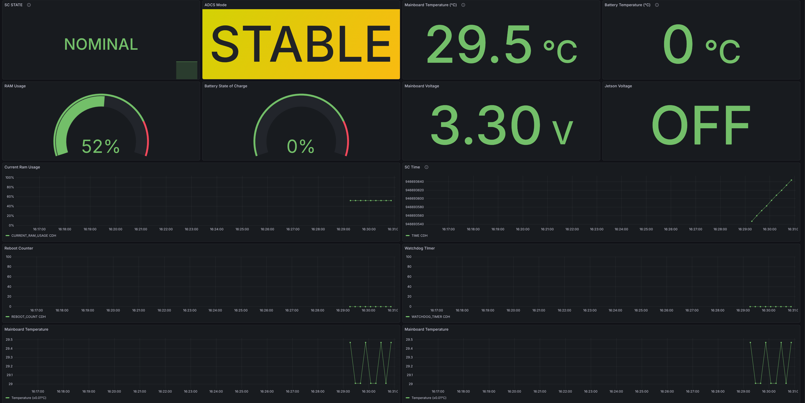

# Satellite Telemetry Database & Visualization System

Initial proposal for a simple system to store and display Argus2 Data




## System Overview

- **Telemetry Ingest Server**: Socket-based server that receives telemetry data. The idea for this program is to minimize the number of dependencies added to GSW. In the perspective of the ground station software, it will just send the decoded dictionary over a socket.
- **InfluxDB**: Time-series database for storing telemetry data
- **Grafana**: Visualization dashboard for monitoring satellite data


Ideally the system would be deployed in a server to be accessible by everyone and using something like portainer to manage the containers

## Architecture

```
Ground Station → Socket (Port 5555) → Ingest Server → InfluxDB →    Grafana
                   JSON over TCP                      (Storage)  (Visualization)
```

## Quick Start

### 1. Start the Infrastructure

```bash
docker-compose up -d
```

This will start:
- **Ingest Server** on port 5555 (receives telemetry)
- **InfluxDB** on http://localhost:8086
- **Grafana** on http://localhost:3000

### 2. Send Telemetry from Your Ground Station

You can send telemetry with raw sockets:

```python
import socket
import json

# Connect to ingest server
sock = socket.socket(socket.AF_INET, socket.SOCK_STREAM)
sock.connect(('localhost', 5555))

# Send telemetry (JSON + newline)
telemetry = {'CDH': {...}, 'EPS': {...}, 'ADCS': {...}}
sock.sendall((json.dumps(telemetry) + '\n').encode('utf-8'))

# Get response
response = sock.recv(1024).decode('utf-8')  # Should be "OK\n"
```

Or even simpler with netcat for testing:
```bash
echo '{"CDH":{"TIME":946688093},"EPS":{},"ADCS":{}}' | nc localhost 5555
```

## Access the Dashboards

### InfluxDB Web UI
- URL: http://localhost:8086
- Username: `admin`
- Password: `satellite123`
- Organization: `satellite`
- Bucket: `telemetry`

### Grafana
- URL: http://localhost:3000
- Username: `admin`
- Password: `admin`

**Pre-configured Dashboards** (automatically available on first launch):
- **Satellite Overview** - High-level system status and key metrics
- **Satellite Storage** - CDH storage usage, file counts, and storage-health fields
- **EPS - Power System** - Detailed battery, solar, and power monitoring
- **ADCS - Attitude Control** - Gyro, magnetometer, sun sensors, and attitude

As of right now none of the dashboards are fully completed. Satellite Overview is the most complete one.

## Creating Custom Grafana Dashboards

1. Open Grafana at http://localhost:3000
2. Click "Create" → "Dashboard"
3. Click "Add visualization"
4. Select "InfluxDB" as datasource
5. Use Flux queries to visualize your data

### Example Flux Queries

**Show mainboard temperature over time:**
```flux
from(bucket: "telemetry")
  |> range(start: v.timeRangeStart, stop: v.timeRangeStop)
  |> filter(fn: (r) => r["subsystem"] == "EPS")
  |> filter(fn: (r) => r["_field"] == "MAINBOARD_TEMPERATURE")
```

**Show RAM usage:**
```flux
from(bucket: "telemetry")
  |> range(start: v.timeRangeStart, stop: v.timeRangeStop)
  |> filter(fn: (r) => r["subsystem"] == "CDH")
  |> filter(fn: (r) => r["_field"] == "CURRENT_RAM_USAGE")
```

**Show gyroscope data (all axes):**
```flux
from(bucket: "telemetry")
  |> range(start: v.timeRangeStart, stop: v.timeRangeStop)
  |> filter(fn: (r) => r["subsystem"] == "ADCS")
  |> filter(fn: (r) => r["_field"] =~ /GYRO_/)
```

## Configuration

All configuration is in `docker-compose.yml`:

- **Ingest Server Port**: 5555 (receives telemetry via TCP socket)
- **InfluxDB Port**: 8086
- **Grafana Port**: 3000
- **InfluxDB Token**: `my-super-secret-auth-token` (change for production!)
- **Passwords**: Default passwords should be changed for production use

## Data Retention

By default, InfluxDB keeps all data indefinitely. To set retention policies:

1. Go to InfluxDB UI → Settings → Buckets
2. Edit the "telemetry" bucket
3. Set retention period (e.g., 30 days, 1 year)

## Troubleshooting

### Can't Connect to Ingest Server
Check if the service is running:
```bash
docker-compose ps
docker-compose logs telemetry-ingest
```

Test connectivity:
```bash
nc localhost 5555
# Or
telnet localhost 5555
```

### Connection Issues
If you can't connect to InfluxDB from your Python script:
- Make sure Docker containers are running: `docker-compose ps`
- Check container logs: `docker-compose logs influxdb`

### Grafana Can't See Data
- Verify data is being written: Check InfluxDB Data Explorer
- Check Grafana datasource configuration: Settings → Data Sources → InfluxDB

### Reset Everything
```bash
docker-compose down -v  # Removes all data!
docker-compose up -d
```


## Stopping the System

```bash
docker-compose down
```

To remove all data:
```bash
docker-compose down -v
```

